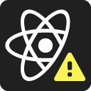

# 开发者工具

在 React 项目中， `React Developer Tools` 是作为浏览器插件引入进来的，可以在应用商店进行安装。

安装完毕后，如果插件检测到当前 Web 页面是 React 项目，则工具小图标会发生变化。

|                             图标                             |                 含义                 |
| :----------------------------------------------------------: | :----------------------------------: |
| <figure style="width:35px;height:35px;margin:0 auto;"></figure> | 当前 Web 页面中没有检测到 React 依赖 |
| <figure style="width:35px;height:35px;margin:0 auto;"></figure> |     当前 Web 页面正处于开发模式      |
| <figure style="width:35px;height:35px;margin:0 auto;"></figure> |     当前 Web 页面正处于生产模式      |
| <figure style="width:35px;height:35px;margin:0 auto;"></figure> |  当前 Web 页面依赖的 React 版本较老  |

`React Developer Tools` 调试入口在浏览器开发者工具中，分别是 `Components` 和 `Profiler` 。

